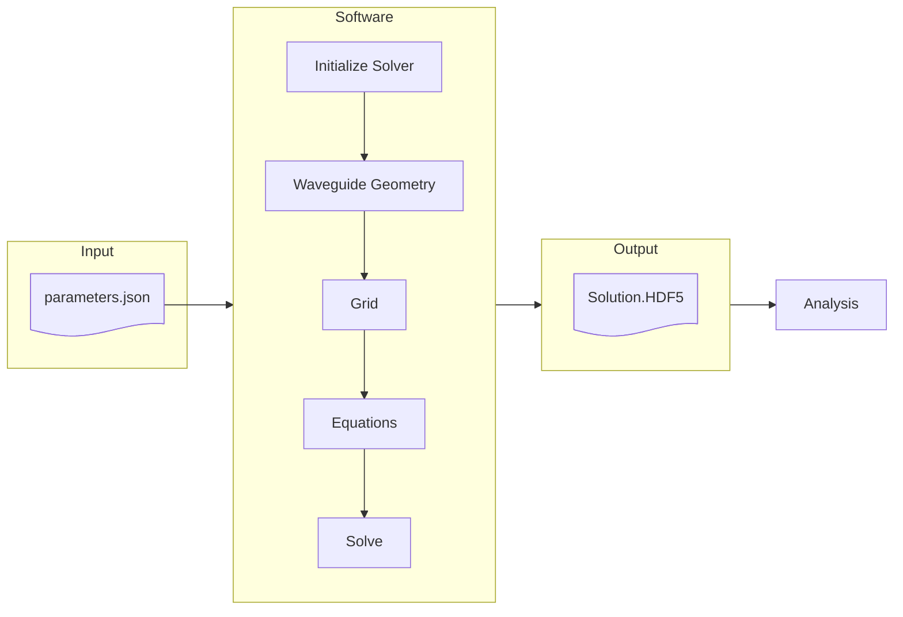

# Photonics - Theory and Simulations

A repository dedicated to the implementation and organization of theoretical content related to the study of photonic circuit design in silicon.

# Contents

- Class materials;

- Numerical solver;

# Numerical Solver

## Main sctructure

### References

- Orfanidis, Sophocles J. "Electromagnetic waves and antennas." (2008).