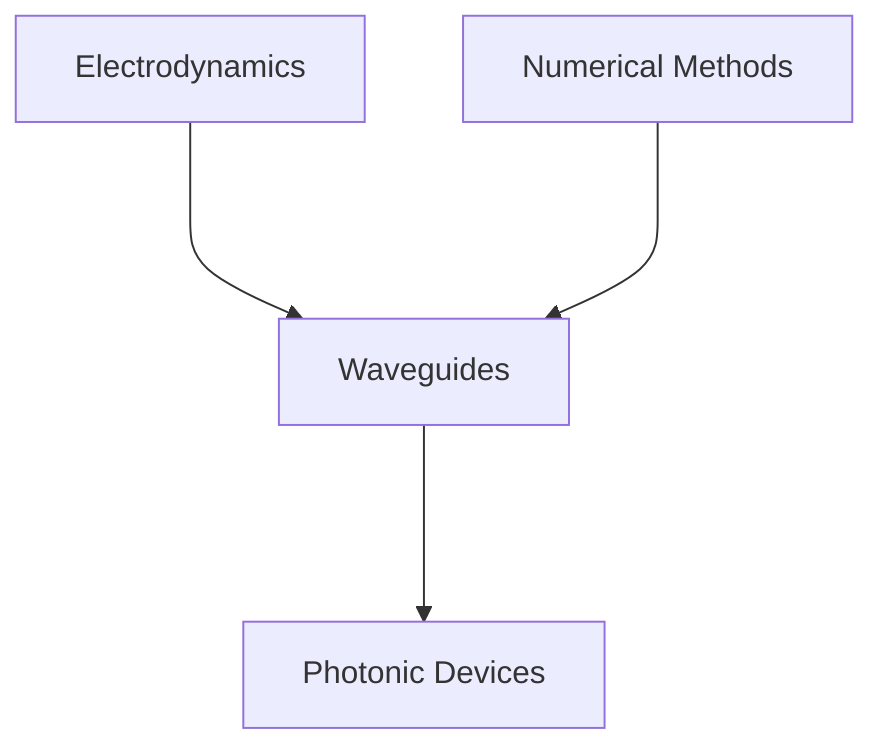

# Photonics - Theory and Simulations

A repository dedicated to the implementation and organization of theoretical content related to the study of photonic circuit design in silicon.

# Contents

# Ansys Optics

https://www.ansys.com/products/optics

## References

- Orfanidis, Sophocles J. "Electromagnetic waves and antennas." (2008).